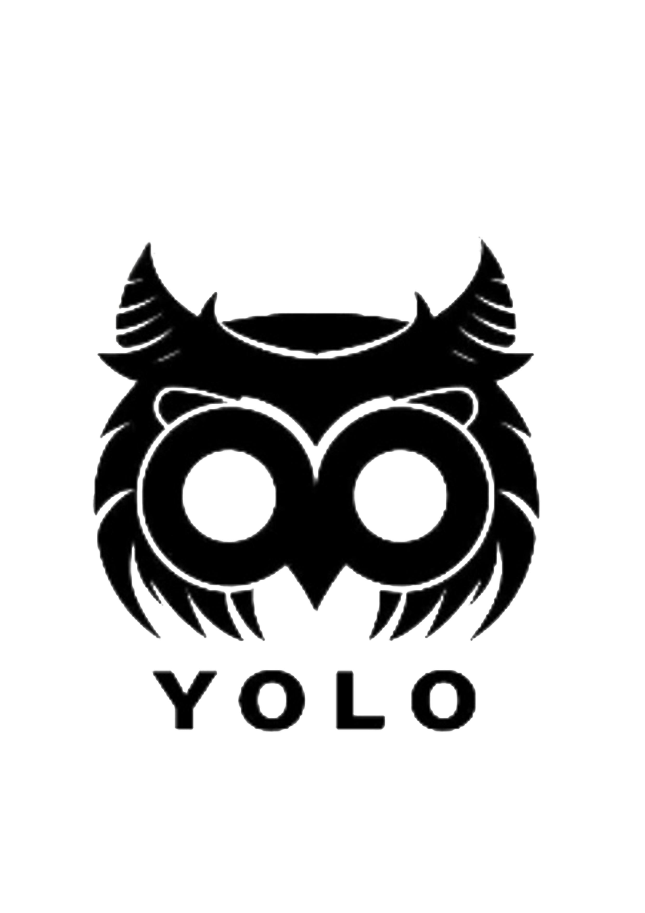

## 🌟 加入YOLO工作室 —— 创造未来，从这里开始！🌟

### 🎉 招新啦！ 🎉 

亲爱的大一新同学们，你们好！👋

你是否对美工设计充满热情？
是否梦想着将自己的创意变为现实？
如果是，那么YOLO工作室正是你寻找的舞台！

## 🚀 你准备好迎接挑战了吗？ 🚀 
### 1. 海报设计大师（二选一，可多选）：
#### 🖌️ 展现你的艺术魅力：
-   ①绘制出一张能够完美诠释YOLO精神的海报。这张海报不仅要展示YOLO精神(You Only Live Once)，更要能够吸引志同道合的伙伴加入我们的大家庭！
* ②绘制出一张自我介绍海报。一张能够脱颖而出，能体现你的美工技术、审美水平，最大程度能够展现自己性格、能力、生活、爱好......的自我介绍海报！我们期待你通过作品展现真实的自我，让每一抹色彩、每一笔线条都充满个人魅力！
#### 🌟 创意无界限：
无论是大胆的色彩搭配，还是独特的设计元素，我们鼓励你将YOLO的理念融入到你的作品中，让这张海报成为你创意的宣言！

### 2. 二创挑战者：（范围不限）
- 🦉立体形象创造：YOLO的图标是一个充满智慧的猫头鹰，我们邀请你以此为灵感，建模创造出一个立体的YOLO猫头鹰形象。这不仅是一次设计挑战，更是一次将平面图像赋予生命的奇妙旅程！
- 🎥 动起来，LOGO！：或者，你可以选择将YOLO的LOGO制作成一个动态视频。让这个标志在你的手中动起来，展现出它的独特魅力和活力。我们期待看到你如何让这个标志在屏幕上跳跃，吸引所有人的目光！
* 其他 
  

### 🌟 我们期待的作品：
- 🎨 原创性：我们渴望看到独一无二的创意，让你的作品在众多设计中脱颖而出。
- 💡 技术性：展示你的设计技巧，无论是手绘、数字艺术还是动画制作，让我们看到你的技艺。
- 🌈 感染力：你设计的作品应该能够触动人心，激发观众的共鸣。

### 🌈 我们期待的你：
- 对设计有独到见解和热情！
- 具备良好的审美和创新能力！
- 愿意学习新技能，不断进步！
- 能够团队合作，共同创造！

### 💌 如何加入？
- 准备你的设计作品，无论是海报还是二创作品，我们都期待看到你的创意！
- **将你的作品发送至我们的招新邮箱：*3573223013@qq.com***
- **别忘了附上你的*联系方式*~和简短的*自我介绍*哦！**

### 📆 截止日期：
- **请在*10.30.23:59*之前提交你的作品，我们迫不及待想要看到你的创意！**
