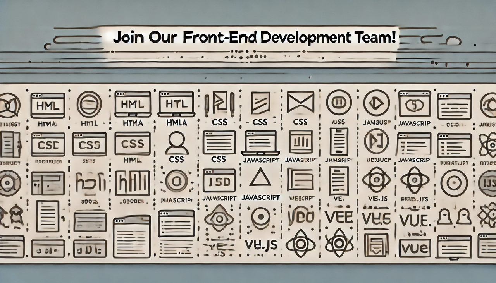

## 提交地址

@施易宏 2712794459@qq.com

@蒙灏冉 2594839508@qq.com

@张雨桐 1320937756@qq.com

## 提交方式

请你先建一个文件夹来保存你做题的答案，文件名字你喜欢就行，然后在这个文件夹下再建一个文件夹assets，这个文件夹用来保存你的代码运行截图或者其他图片，请你每一个部分写一个markdown文档，markdown文档中的图片一律使用相对路径也就是类似于`assets/23134asd.png` 这样的路径

文件夹的结构类似于这样:

然后提交时打包为`.zip` 文件，然后以`学号-姓名-方向-部分` 的形式提交，示例`202309091565-小明-前端-下拉菜单` 。

文档不应该仅仅包含你的做题答案，还应该包含你做题时遇到的问题和解决的方式，我们更希望看到你的学习过程。

## 简介

你是否对炫酷的网页和APP界面感兴趣？你是不是曾经想过，能不能有一天自己也能做出那些精美的页面？那前端开发这个职位简直就是为你量身定做的！💻🌟

### 前端是什么？👀

简单来说，前端就是网站或APP里用户能直接看到和操作的部分。那些漂亮的按钮、流畅的动画、炫酷的页面布局，背后都有前端开发的影子。你可能听说过一些前端技术，比如：

- HTML：用来搭建网页的骨架，告诉浏览器这里有一个标题，那里有一段文字。
- CSS：给页面加上颜值，决定颜色、字体、布局，CSS就是前端的美妆师！
- JavaScript：让页面动起来，像按钮点击后显示弹窗、表单验证等，都是它的功劳。

这三者就是前端的基础技能啦，掌握了它们，你就能开始构建自己的网站和APP了！🎨

### 前端的日常工作是什么？🛠️

前端开发的日常工作充满了创意和挑战，你可能会：

1. 设计和实现用户界面：把设计师的美丽设计稿变成真正可以操作的页面。
2. 优化页面性能：让页面加载得更快，用户体验更顺滑。
3. 调试和解决问题：每个按钮、每个动画都需要精心调试，确保它们在各种设备上都能正常工作。
4. 与设计师和后端工程师合作：在团队中，前端不仅要和设计师讨论视觉效果，还要和后端工程师协作，确保数据能顺利显示出来。

### 为什么选择前端？🎉

前端开发绝对是一门既实用又有趣的技能！如果你：

- 喜欢把想法变成现实🎨
- 享受和设计师一起创造美的过程💡
- 对用户体验有追求，想让大家都爱上你的作品👨💻

那前端开发就非常适合你！而且，前端是个飞速发展的领域，总能接触到最新的技术和趋势，学到的新东西绝对让你眼界大开！🚀

### 我们需要怎样的小伙伴？🤩

如果你对前端有兴趣，不论是有一定基础，还是刚刚开始了解，YOLO工作室都欢迎你加入！我们希望你：

- 热爱学习：前端技术更新很快，保持学习才能跟上节奏。
- 乐于沟通：团队合作很重要，你需要和设计师、后端工程师愉快合作。
- 注重细节：前端开发就是要把每一个小细节都做得完美。

在YOLO工作室，我们提供的是一个开放、自由、有趣的环境，让你尽情发挥自己的创造力。还等什么呢？快来加入我们，一起打造属于你的前端世界吧！🎉💻

期待你的加入！YOLO，等你来战！🚀

## 学习路线

1. HTML + CSS
2. Javascript -> AJAX, Node.js, Webpack
3. 框架 Vue, React

## Hello YOLO!

出题人：张雨桐

### 题目描述

🌟 **初入前端的世界** 🌟想必你一定有自己的志向和期盼 🎯✨。那么，就来运用你所学的 **HTML** 知识，向我们做一个属于你自己的自我介绍吧！📜👋🎉 展示你的创意与热情，让我们了解你的独特风采 🌟👨💻👩💻。

### 🌟 **要求** 🌟

- 尝试做得有趣一些，凸显你的个人风格 🕶️🌟。
- 可以添加一些照片 📸📷，让你的介绍更加生动和独特 🎉🌈。展示你的创意，让每个人都记住你的精彩自我介绍！🚀👋🎨

知识点：HTML标签的综合应用

## 家乡介绍

出题人：张雨桐

### 题目描述

​      上大学之后我们认识了五湖四海的同学，大家来自不同的地方，感受过不同的风土人情。你的家乡是哪里呢？🌏🏡 发挥你的创意，利用HTML和CSS制作一个网页向大家介绍一下吧！

### 🌟 **要求** 🌟

- 不少于3个页面📄📄📄
- 实现顶部导航栏，确保内容的易访问性🔝
- 内容可以丰富，包括自然环境🌄、著名景点🏰、美食等等🍜
- 尝试利用瀑布流添加一些照片，让网页更具视觉冲击力🌊📸

✨通过这个项目，我们不仅希望了解你的编程能力，还期待通过你的眼睛看到一个不一样的世界！🌍🌟🎨

知识点：本题需要对CSS盒子模型进行熟练运用并创新，同时可以多多尝试实现瀑布流的多种方式。

Tips：

- [https://www.bilibili.com/video/BV1LpHreRE9Z/?spm_id_from=333.337.search-card.all.click&vd_source=b08229734fc1b14aeb3fb2232f5fdee7](https://www.bilibili.com/video/BV1LpHreRE9Z/?spm_id_from=333.337.search-card.all.click&vd_source=b08229734fc1b14aeb3fb2232f5fdee7)

## 简单动画

出题人：张雨桐

### 题目描述

​      相信你一定看过各种各样的动画💻，不管是经典卡通还是炫酷的3D特效✨。那么你是否想过自己创作一个动画呢？其实学习了CSS之后，我们就可以开始制作一些简单的动画啦🎉！还可以将制作的小动画加入到个人博客中📄，就可以让博客变得更美观丰富哦🎨！

​      在网上查找有关CSS制作动画的相关资料，发挥想象力，尝试制作你的小动画吧！

### 🌟 **要求** 🌟

- 首先完成整个网页的布局，让页面简洁美观
- 小动画可以是整个网页的重点，也可以是穿插在周围的小细节

### 附加题：

- 利用3D转换实现立体效果

知识点：本体需要了解CSS3动画的制作以及3D转换的拓展

Tips：

- [https://www.runoob.com/css3/css3-3dtransforms.html](https://www.runoob.com/css3/css3-3dtransforms.html)
- [https://www.runoob.com/css3/css3-animations.html](https://www.runoob.com/css3/css3-animations.html) 

## 模拟弹幕

出题人：蒙灏冉

### 题目描述：

每次看 **B站** 视频都会看到很多有意思的弹幕🎥，如今我们来模拟弹幕的效果✨。

请使用 **HTML**、**CSS** 和 **JS** 来实现弹幕功能📜。享受这个有趣的挑战吧🎉！

### 🌟 **要求** 🌟

- 随便找一个视频🎬
- 使用 **原生 JS** ✨
- 在 JS 中存储一个事先准备好的弹幕列表📜，可以多写几个弹幕，在视频播放时循环显示，从视频的最右边滑到最左边🖥️
- 弹幕在视频中的高度是随机的🎢
- 视频下方可以输入自己的弹幕💬，点击发送后也能在视频中显现🎉

### 提示：

- 了解一下 **随机数** 和 **定时器** 的用法🔢⏲️
- 使用\<span\>作为弹幕容器📦，让弹幕从视频的最右边出现，滑动到最左边消失后再移除🖥️➡️🚪
- 自己输入的弹幕可以醒目一点，比如设置边框颜色🎨🖍️

### **附加题**：

- 添加一个 **弹幕隐藏功能**，想不看弹幕时就隐藏它🔒
- 实现每条弹幕的 **字体颜色随机** 🌈
- 如果你做完了所有后面的题还有时间，可以学习 **TypeScript** 📚，尝试将 `.js` 文件修改成 `.ts` 文件，并提交 `.ts` 文件✏️📁

知识点：本题需要熟练掌握javascript基本的编程知识以及部分javascript的内置函数

Tips:

- [https://www.runoob.com/js/js-tutorial.html](https://www.runoob.com/js/js-tutorial.html)
- [https://www.runoob.com/w3cnote/js-timer.html](https://www.runoob.com/w3cnote/js-timer.html)  
- [https://www.runoob.com/jsref/jsref-random.html](https://www.runoob.com/jsref/jsref-random.html)

## 轮播图

出题人:施易宏

### 题目描述:

🌍✈️ 你是一个旅行者，正在设计一个迷人的轮播图组件。这个组件主要展示来自世界各地的风景照片，吸引摄影爱好者和旅行者的关注 📸🌄。你需要开发一个美观、功能强大的轮播图，以便在首页展示精选的旅游照片 🌟🏞️。

### 🌟 **要求** 🌟

- 🎨✨ 选择一个框架（Vue 或 React）来完成这个迷人的轮播图组件！📸🌟
- 轮播图可以通过左右按键进行切换 ⬅️➡️。
- 轮播图会定时自动播放 ⏳🔄。

### **附加题**:

- 让轮播图能够循环播放，并且实现有动画的切换效果 🎢🎞️。挑战一下，看能否达到 B 站首页左上角轮播图的效果 💻🎬。

知识点：需要安装框架并对框架进行初步的了解

Tips:

- [https://cn.vuejs.org/guide/introduction.html](https://cn.vuejs.org/guide/introduction.html)
- [https://zh-hans.react.dev](https://zh-hans.react.dev)

## 下拉菜单

出题人:施易宏

### 题目描述:

作为一个前端工程师，🛠️ 在开发过程中，如果每个组件都由自己来写，那么开发效率会比较低下 😓。为了解决效率问题，我们可以在合适的地方使用前人大佬开发的组件 📦，例如 **ElementPlus** 这一组件库中就包含了很多常用组件 🎨。请你调用ElementPlus组件库(或者其他任一组件库)实现菜单功能

### 要求

- 包含子菜单🗂️
- 实现一个垂直菜单 🌿,一个水平菜单🌟

### 提示:

组件库是前端开发中必不可少的东西,学会使用组件库能够大大提高开发效率

知识点：了解各个框架的组件库

## webstorm

出题人:施易宏

### 题目描述:

💻 作为一个前端工程师，**WebStorm** 是一个必不可少的工具！🛠️🔍

请你仿造webstorm中文官网（[https://www.jetbrains.com/zh-cn/webstorm/](https://www.jetbrains.com/zh-cn/webstorm/)），绘制一个网页.🌐✨

### 🌟 **要求** 🌟

- 使用 **Vue** 或 **React** 来完成仿写网页 🌐🔧。
- 实现官网开发者评价中的 **翻页效果** 📜🔄。
- 实现 **右侧悬浮点击评价** 的效果 🖱️💬。
- 实现 **鼠标悬浮在隐私政策的图标上** 时弹出的 **悬浮提示框** 效果 🛡️💡。

### 提示:

需要花费一定的时间成本来学习框架 🕒📚，但这无疑是前端开发的必备技能 💪🚀。掌握框架后，你将能够更高效地完成以后的项目 🌟💻，显著提高开发效率 ⚡🔧。让我们投资时间，提升技能，为未来的开发之路打下坚实的基础！🌈👨💻👩💻

知识点：熟练掌握框架语法知识，理解其逻辑结构

Tips:

- [https://cn.vuejs.org/guide/introduction.html](https://cn.vuejs.org/guide/introduction.html)
- [https://zh-hans.react.dev/learn](https://zh-hans.react.dev/learn)

